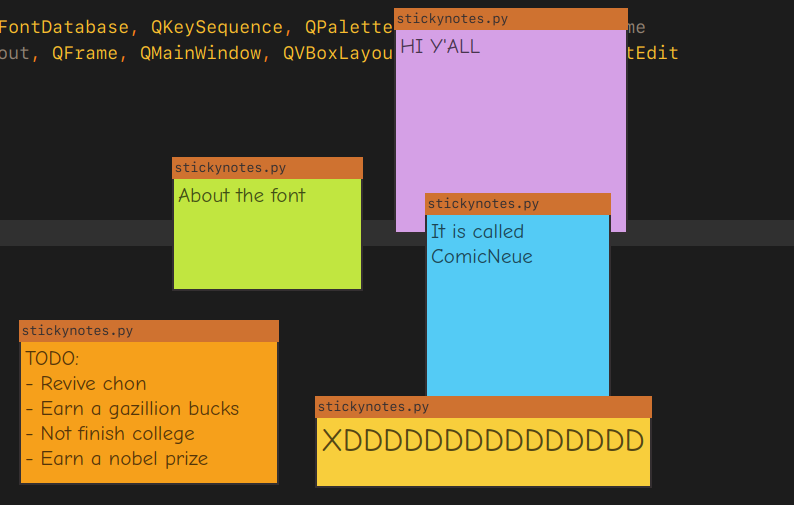

# Stickynotes:

Stickynotes é um pseudo-clone do Notepad do Windows, para interação simples com arquivos de texto.

## Imagem

## Baixando:

Ter o python 3.12+ instalado

``pip install PyQt6``

## Usando:

Recomendo criar um script bash (linux) ou batch (windows) para a execução do programa.

Executando manualmente:

``python3 stickynotes.py`` ou ``python3 stickynotes.py arquivo-para-abrir.txt``

## Atalhos:

- ``Ctrl+O``: Abrir um arquivo
- ``Ctrl+S``: Salvar texto atual
- ``Ctrl++`` e ``Ctrl+-``: Zoom do texto
